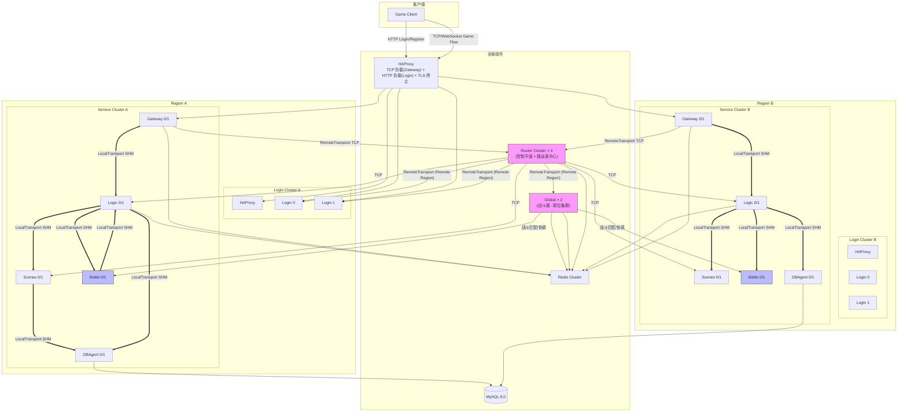
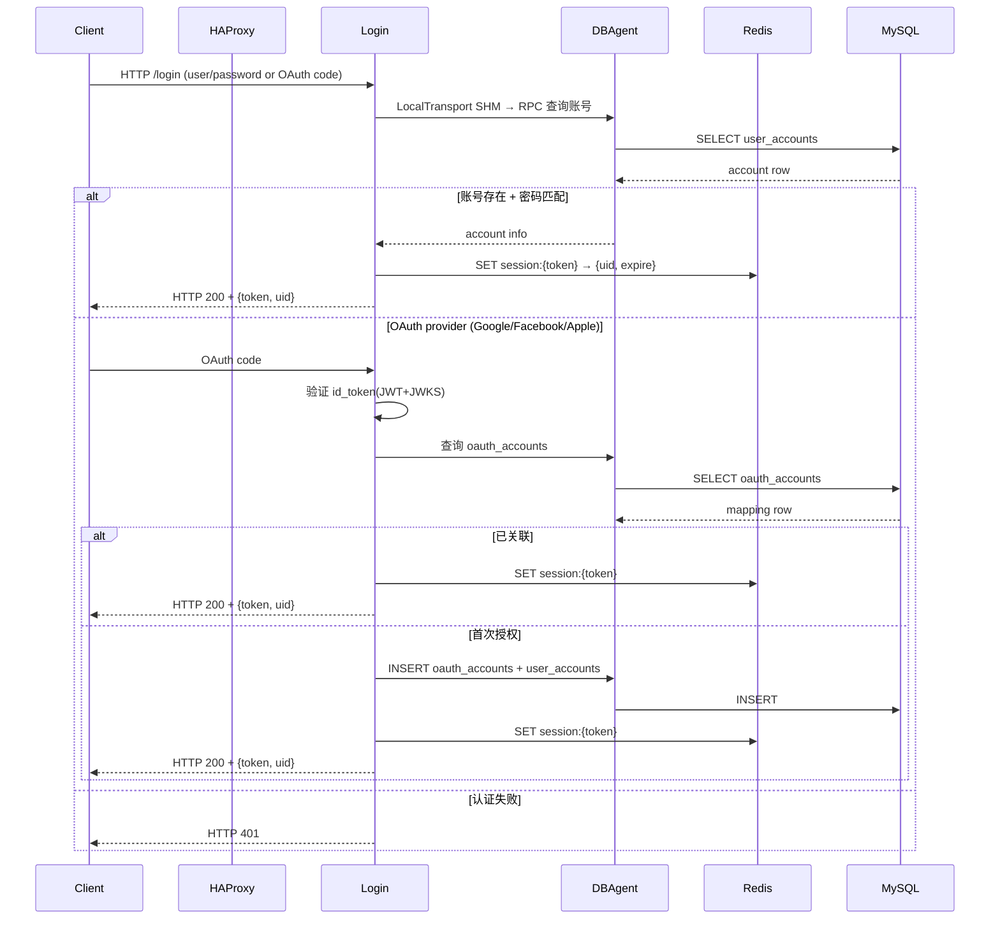
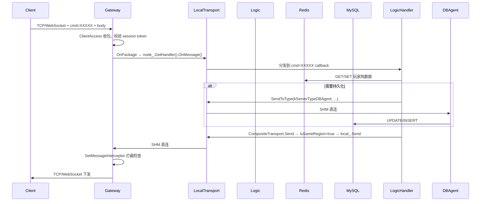
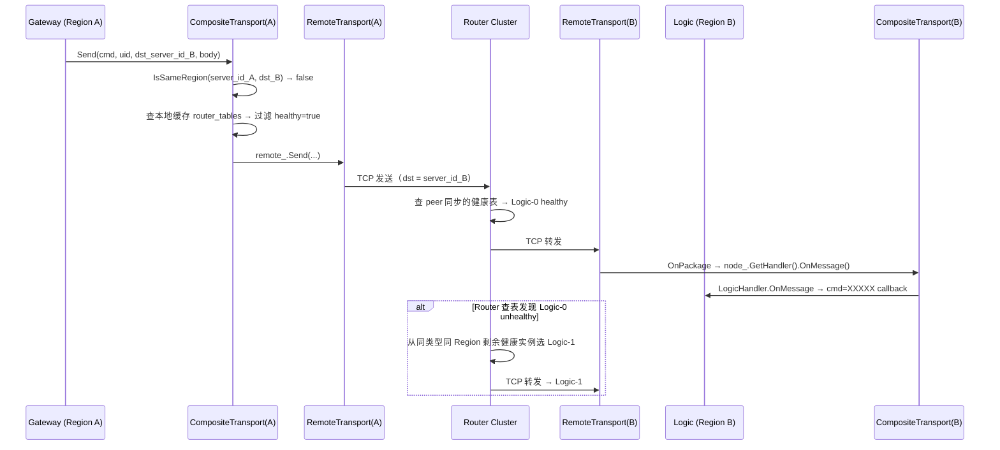
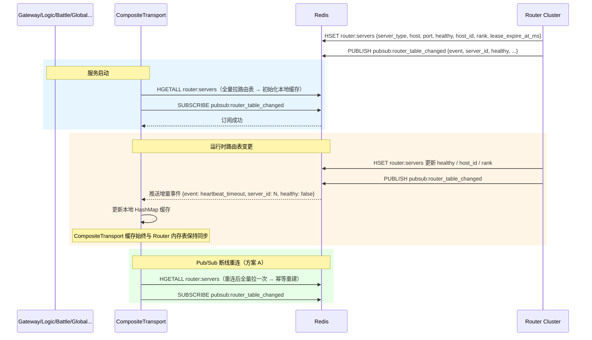
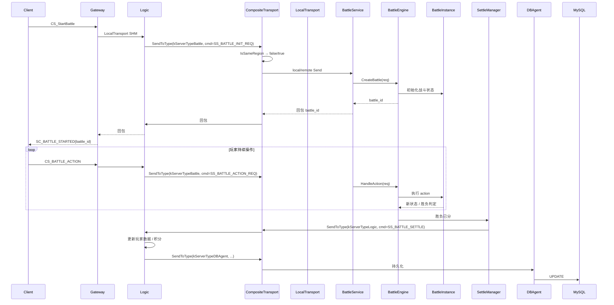

# 分布式游戏服务器框架 —— 架构设计

本文档描述分布式游戏服务器框架的总体架构、服务节点职责、通信模型、核心业务流程、数据存储与关键设计模式。面向框架维护者和业务服务开发者，重点阐述 INode 中介者 + ITransport 抽象层 + MessageHandler 流水线 三大核心支柱。

## 目录

1. [项目定位与约束](#1-项目定位与约束)
2. [架构全景](#2-架构全景)
3. [服务节点详解](#3-服务节点详解)
4. [通信架构](#4-通信架构)
5. [核心流程](#5-核心流程)
6. [数据存储设计](#6-数据存储设计)
7. [关键设计模式](#7-关键设计模式)
8. [部署架构](#8-部署架构)

---

## 1. 项目定位与约束

### 1.1 项目定位

分布式游戏服务器框架（以下简称"本框架"或"DGSF"）是一个 **进程化微服务** 的 C++17 游戏服务器集群。框架将典型 MOBA / MMORPG 所需的能力拆分为 **8 种服务节点**，通过 `server_id` 高 16 位（Region）区分物理区域，在同 Region 内用 Boost.Interprocess 共享内存消息队列（ShmQueueRpc）实现亚毫秒级 IPC，跨 Region 由 CompositeTransport 选定目标实例后经 RemoteTransport → Router Cluster 代理转发。业务层通过 **INode 中介者 + CompositeTransport + MessageHandler** 三件套与底层通信完全解耦，业务服务开发者只需注册 cmd 处理器，无需关心底层走 SHM 还是 TCP。

### 1.2 主要技术约束

| 约束 | 说明 |
|------|------|
| C++17 单体仓库 | 所有服务共用一份 CMake 顶层，减少构建复杂度 |
| Boost.Asio 单线程 io_context | 每个服务实例 1 个 io_context，多实例并行，避免共享状态 |
| Protobuf + gRPC | 统一消息编码；gRPC 仅用于跨语言接口预留，内部 RPC 走 SHM/TCP |
| 共享内存文件命名 | 以 `server_id` 为 key，每个服务实例一组 SHMQ（1 pull + N push） |
| Redis + MySQL | Redis 做热数据/排行榜/路由表存储，MySQL 做持久化存储 |
| 8 种服务节点固定集 | Router Cluster / Gateway / Login / DBAgent / Logic / Scenes / Global（战斗服） / Battle（战斗引擎实例），由 ServerType 枚举统一管理 |
| ServerID 编码规则 | `uint32_t server_id = [region:4bit] [server_type:4bit] [index:8bit] [reserved:16bit]`；例：Region A(1) + Logic(3) + index(0) = 0x13000000 |

### 1.3 通信架构概览

| 场景 | 协议/通道 | 说明 |
|------|-----------|------|
| 客户端 → Gateway | TCP / WebSocket | HAProxy 前置 TCP 负载均衡；Login 走 HTTP 重定向登录 |
| 服务 → 服务（同 region） | **SHM 消息队列**（ShmQueueRpc，MPSC DescriptorRing） | LocalTransport 直连目标服务的 pull 队列，无中间转发 |
| 服务 → 服务（跨 region） | **TCP** → Router Cluster → 目标 RemoteTransport | Router Cluster 维护所有在线服务的 server_id → 地址映射，按目标 server_id 精确路由 |
| Gateway → Logic → DBAgent | SHM（同 Region） | 典型热路径，走 LocalTransport（同 Region SHM Queue） |
| Router Cluster → 各服务 | Redis Pub/Sub + 启动拉取 | Router Cluster 作为路由表中心：启动时各服务从 Redis 全量拉取 `router:servers`，运行时通过 Pub/Sub 接收增量变更 |
| Login → DBAgent | SHM（同 Region）或 TCP（跨 Region） | OAuth 三提供商账号校验 |
| Scenes / Battle → Logic | CompositeTransport Region 策略 | 战斗结算通知、场景状态同步 |

---

## 2. 架构全景

### 2.1 架构全景图



### 2.2 服务节点一览表

| # | 服务类型 | C++ 枚举 | 目录 | 二进制 | 容器部署 | 核心职责 |
|---|---------|---------|------|--------|---------|---------|
| 1 | **Router Cluster** | `kServerTypeRouter` | `router` | 独立进程，×4 | **控制平面 + 路由表中心**：服务注册发现、连接心跳、跨 Region 代理转发、故障转移、Region 拓扑管理、路由表同步下发 |
| 2 | Gateway | `kServerTypeGateway` | `gateway` | server 容器 ×2 + battle 容器 ×0 | 玩家 TCP/WebSocket 接入、心跳、uid↔session 映射、CS 下行拦截器 |
| 3 | Login | `kServerTypeLogin` | `login` | 独立 login 容器 ×2 | HTTP 注册/登录、**OAuth 2.0（Google/Facebook/Apple）**、token/session 分发 |
| 4 | Logic | `kServerTypeLogic` | `logic` | server 容器 ×2 | 玩家状态、会话验证、核心业务、GM 命令、OnBefore 打开共享内存 |
| 5 | Scenes | `kServerTypeScenes` | `scenes` | server 容器 ×2 | 场景/地图/房间、位置同步、gRPC 跨语言接口预留 |
| 6 | **Global（战斗服）** | `kServerTypeGlobal` | `global` | 独立 global 容器，**多 host + 多 rank 顺位集群** | **战斗服（规则计算式 Leader 自动确定）**：战斗匹配、战斗队列管理、跨战斗实例协调、排行榜、全服广播；Leader 身份由路由表 + host_id/rank 顺位规则实时计算，无分布式锁无选举动作；状态 SHM→Redis→MySQL 三级恢复 |
| 7 | DBAgent | `kServerTypeDBAgent` | `dbagent` | server 容器 ×2 + battle 容器 ×2 | MySQL 访问代理、动态建表、读写 RPC |
| 8 | **Battle（战斗引擎）** | `kServerTypeBattle` | `battle` | 独立 battle 容器 ×2 | 战斗引擎实例：BattleInstance、BattleRule、SettleManager、StatsManager、Battle gRPC 接口 |

### 2.3 部署拓扑

单台主机的典型部署：

```text
Host 1 (server container)
├── DBAgent          ×2   (dbagent 0, dbagent 1)
├── Gateway          ×2   (gateway 0, gateway 1)
├── Scenes           ×2   (scenes 0, scenes 1)
└── Logic            ×2   (logic 0, logic 1)

Host 2 (battle container)
├── DBAgent          ×2
└── Battle           ×2   (battle 0, battle 1)

Host 3 (login container)
└── Login            ×2   (login 0, login 1)

Host 4a (global container, 顺位 Host-A)
└── Global           ×2   (global host-A rank-1, global host-A rank-2)

Host 4b (global container, 顺位 Host-B，远程兜底)
└── Global           ×2   (global host-B rank-1, global host-B rank-2)

Host 5 (router container)
└── Router           ×4   (router 0..3，peer 互联)
```

生产部署按 Region 分主机，每 Region 一组 server/battle/login 进程，跨 Region 通过 TCP → Router Cluster 代理转发。Router Cluster 承担路由表管理和同步下发，各服务启动时从 Redis 全量拉取路由表。

---

## 3. 服务节点详解

### 3.1 Router Cluster（×4）

Router Cluster 是集群的 **唯一控制平面 + 健康状态权威源 + 路由表分发中心**，独立于业务节点体系存在。4 个 Router 实例组成集群，通过 peer 协议实时同步服务注册表、健康状态和 Region 拓扑。

#### 核心职责

| 维度 | 职责 |
|------|------|
| **服务注册** | 业务节点连接建立后，通过协议消息上报 `server_id`、`server_type`、端口、`host_id`（部署机器）、`rank`（本机顺位）；Router 维护内存表 + Redis Hash 双写 |
| **心跳检测（分级超时）** | Global 类型每 1s 发 TCP 心跳，超时 **4s**（TCP 可靠传输，重连后才判断死亡，容忍短暂 pause）；其余业务节点每 3s 发心跳，超时 **10s**；超时即标记 `healthy=false` |
| **观察者列表 + 路由表推送** | Router 把所有已注册业务节点加入**观察者列表**；每次路由表变更（心跳超时、新实例注册），**主动推送增量事件**到观察者列表中的所有进程（Pub/Sub + 长连接双通道，Pub/Sub 作为跨 Router 传播的总线） |
| **路由表快照存储** | 完整路由表以 Redis Hash `router:servers` 持久化，字段含 `{host, port, healthy, host_id, rank, lease_expire_at_ms}`；业务进程启动时先全量加载再订阅增量 |
| **跨 Region 代理转发** | 收到 RemoteTransport 发来的跨 Region TCP 包后解析 `msg.head.dst`，查本地健康表定位目标实例地址，精确转发；同 Region 流量由 LocalTransport 直接走 SHM，不经过 Router |
| **故障转移** | 转发时若目标节点已被标记不健康，或 TCP 连接失败，从同类型同 Region 剩余 **健康** 实例中选一个重发，对调用方无感 |
| **Region 拓扑** | Router 之间通过 peer 连接交换 Region 拓扑和节点存活信息，跨 Region 转发时 Router 自主决定下一跳 |

#### 分级心跳 + 观察者推送 + 路由表完整链路

```text
                         Router Cluster（×4，peer 互联）
                         ┌──────────────────────────────────────────────┐
                         │                                              │
  Global 实例 ──TCP 心跳(每 1s)──►  Router A（连接超时 4s，TCP 可靠传输）
  其他实例 ──TCP 心跳(每 3s)──►  Router A（连接超时 10s，TCP 可靠传输）
                         │                                              │
                         ├─ 超时？                                      │
                         │   YES → memory HSET unhealthy                │
                         │       Redis HSET router:servers unhealthy    │
                         │       ├─ peer 同步给 Router B/C/D（≤100ms） │
                         │       └─ PUBLISH router_table_changed         │
                         │            {event: "heartbeat_timeout",      │
                         │             server_id: N,                    │
                         │             server_type: Global,             │
                         │             healthy: false}                  │
                         │                                              │
                         │   NO → 更新 lease_expire_at_ms，healthy=true │
                         │                                              │
                         └──────────────────────────────────────────────┘
                                            │
                                            │ Pub/Sub + 长连接 推送
                                            ▼
                      CompositeTransport（所有业务进程本地缓存）
                      ├─ HashMap: server_id → {host, port, healthy, host_id, rank}
                      ├─ 收到增量事件 → O(1) 更新本地缓存
                      ├─ SendToType(kServerTypeLogic)
                      │    → 查本地缓存 → 过滤 healthy=true
                      │    → 按 server_type 内的 rank 顺位或一致性哈希选实例
                      │    → IsSameRegion → LocalTransport / RemoteTransport
                      │
                      └─ Global Follower 收到 Global 类型 unhealthy 事件
                           → CompositeTransport 更新本地缓存
                           → determineMyRole() 重新计算顺位链
                           → 我是 healthy_chain[0]？
                              YES → 自动切换 Leader → 三级状态恢复 → 接管
                              NO  → 继续待命
```

4 个 Router 实例通过 **peer 协议**（TCP 长连接）实时同步健康状态、路由表变更和 Region 拓扑。任一 Router 检测到节点不健康后 100ms 内通过 peer 消息通知其他 3 个 Router，保证推送信息在整个集群中一致传播。

#### 路由表结构（Router 内存表 + Redis Hash）

```json
{
  "server_id:10001": {
    "server_type": "Global",
    "host": "192.168.1.10",
    "port": 12001,
    "healthy": true,
    "host_id": "host-A",
    "rank": 1,
    "lease_expire_at_ms": 1761234567890
  },
  "server_id:10002": {
    "server_type": "Global",
    "host": "192.168.1.10",
    "port": 12002,
    "healthy": true,
    "host_id": "host-A",
    "rank": 2,
    "lease_expire_at_ms": 1761234567890
  }
}
```

#### 项 | 实现

| 项 | 实现 |
|----|------|
| 定位 | 独立 TCP 服务端，不纳入 INode 体系 |
| 启动 | 加载本地配置 → 初始化日志 → Redis 连接 → 加载已有路由表 → 创建 RouterService → Start() |
| ITransport | ❌ 不使用（自身就是 TCP 服务端 + 路由决策中心） |
| 健康状态存储 | Router 本地内存表 + Redis Hash `router:servers`（字段含 host_id / rank / lease_expire_at_ms）双写 |
| 观察者推送 | Pub/Sub `pubsub:router_table_changed`（增量事件）+ 长连接推送（集群内快速传播）双通道 |
| peer 协议 | Router 之间 TCP 长连接；同步服务注册表、健康状态、Region 拓扑变更；延迟 ≤ 100ms |
| 分级心跳超时 | Global 类型 4s（TCP 可靠传输，重连后才判断死亡，容忍短暂 pause）、其余业务节点 10s、Router 自身 peer 4s |

#### Router Cluster 脑裂防护

Router Cluster 采用 **peer 最终一致性 + Redis Cluster 跨 AZ 部署**，**不额外引入 Raft 等强一致协议**：

- **脑裂概率极低**：Router Cluster 部署依托 Redis Cluster 跨 AZ（可用区），4 个 Router 实例分散在不同物理主机，脑裂等同于 Redis Cluster 级别的网络分区，属于基础设施级故障，处理策略是"视为 Redis Cluster 故障"
- **CompositeTransport 端幂等保护**：即使极端脑裂场景下 CompositeTransport 从不同 Router 拿到不一致的路由表，业务层也有自校验 —— 每条消息目标节点不响应会自动重试或降级
- **peer 同步自愈**：Router 之间 TCP 长连接同步，分区恢复后 peer 协议会自动交换视图差异，在 ≤100ms 内收敛到一致状态
- **不引入 Raft 的理由**：4 节点 Raft 集群本身就是单 Master 模型，Router Cluster 的 peer gossip + Redis Pub/Sub 已经在健康状态传播延迟和收敛时间上满足游戏服务器需求（≤100ms），引入 Raft 会增加集群复杂度而收益有限

### 3.2 Gateway

Gateway 是玩家接入网关，同时支持 **TCP** 和 **WebSocket** 两种客户端接入方式。

| 项 | 内容 |
|----|------|
| 继承 | `GatewayService : public INode` |
| ITransport | `CompositeTransport`（local_ = SHM，remote_ = TCP→Router） |
| IMessageHandler | `GatewayHandler`（继承 `MessageHandler`） |
| 客户端接入 | `ClientAccess`（TCP 长连接）+ `WebSocketAccess`（WebSocket，独立 IClientAccess 实现） |
| 职责 | uid↔session 映射、心跳超时踢人、CS 下行拦截（GM 命令过滤） |
| 关键钩子 | SetMessageInterceptor：将下行消息转发前做内容检查（防作弊 GM 命令下发） |

### 3.3 Login

Login 提供 HTTP 登录注册 + OAuth 2.0 第三方认证。

| 项 | 内容 |
|----|------|
| 继承 | `LoginService : public INode` |
| ITransport | `CompositeTransport` |
| IMessageHandler | `LoginHandler` |
| HTTP | 内嵌 HttpServer，路由 `/register`、`/login`、`/oauth/google`、`/oauth/facebook`、`/oauth/apple` |
| OAuth | 授权码模式 + JWT 验证；id_token 验签（JWKS endpoint） |
| 数据持久化 | 经 CompositeTransport → LocalTransport/SHM → DBAgent |
| Token | 签发 JWT access_token + Redis 中 session 记录 |

### 3.4 DBAgent

DBAgent 是 MySQL 统一访问代理，业务服务 **绝不应** 直接持有 mysql-connector 连接。

| 项 | 内容 |
|----|------|
| 继承 | `DBAgentService : public INode` |
| ITransport | `CompositeTransport` |
| IMessageHandler | `DBAgentHandler` |
| MySQL | 每实例一个连接池；动态建表（从 protobuf `field_options(dgsf.db_table)=...` 读取表结构） |
| OAuth 表 | 保留 `oauth_accounts` 表：provider + provider_user_id → user_id 映射 |
| 请求分发 | 按 cmd 分发到 DB 请求处理器；写操作串行化保证单请求完整性 |

### 3.5 Logic

Logic 是业务核心。

| 项 | 内容 |
|----|------|
| 继承 | `LogicService : public INode` |
| ITransport | `CompositeTransport` |
| IMessageHandler | `LogicHandler` |
| 玩家数据 | Redis 热数据 + DBAgent 持久化 |
| OnBefore 钩子 | `LogicHandler::OnBefore` 中打开玩家共享内存块（`ShmUserBlock`），为同进程同 region 跨 Logic 实例共享 |
| GM 命令 | cmd 表中注册 GM 命令处理器，支持在线 GM 指令下发 |
| CS 路径 | Gateway → LocalTransport(SHM) → LogicHandler → OnMessage → 业务处理 → CompositeTransport.Send → LocalTransport(SHM) → Gateway → ClientAccess |

### 3.6 Battle

Battle 是独立战斗服务，承担完整的战斗引擎职责。

| 项 | 内容 |
|----|------|
| 继承 | `BattleService : public INode` |
| ITransport | `CompositeTransport` |
| IMessageHandler | `BattleHandler` |
| 核心组件 | `BattleEngine`（工厂 + 注册表）、`BattleInstance`（单场战斗状态）、`BattleRule`（胜负判定规则）、`SettleManager`（结算分发）、`StatsManager`（战报统计） |
| BattleEngine | `CreateBattle(SSBattleInitReq)` → 生成 `battle_id` → 注册到 map；`OnTick()` 推进所有活跃 BattleInstance；`HandleAction(SSBattleActionReq)` 处理玩家操作 |
| 跨语言接口 | `battlerpc.proto` 预留 gRPC 接口，供 Python / Go 活动服调用 |
| 容器 | 独立 `docker/battle/docker-compose.yml`；启动脚本 `start_battle.sh`：dbagent×2 + battle×2 |
| 与 Logic 协作 | 战斗开始由 Logic → CompositeTransport → Battle 发起；结算结果 Battle → CompositeTransport → Logic |

### 3.7 Scenes

| 项 | 内容 |
|----|------|
| 继承 | `ScenesService : public INode` |
| ITransport | `CompositeTransport` |
| IMessageHandler | `ScenesHandler` |
| 职责 | 场景、地图、房间/大厅、位置广播；gRPC 预留 Scenes 跨语言接口 |

### 3.8 Global（战斗服）—— 顺位集群（规则计算式 Leader 自动确定）

Global 是集群的 **战斗协调层**，不直接执行战斗逻辑（那是 Battle 引擎实例的职责），而是负责匹配、队列、跨战斗实例协调和全局广播。Global 采用 **主从（Leader-Follower）多实例顺位集群部署**，**Leader 身份是路由表 + 顺位规则的派生属性**——不需要分布式锁、不需要抢锁动作、不需要显式选举流程。Router Cluster 是唯一健康权威，Global 实例向 Router 注册时上报 `host_id` + `rank`，Router 心跳超时后推送路由表增量事件，**每个 Global 进程收到路由表变更后重新计算顺位链：顺位链上第一个 healthy 的 Global 实例就是 Leader**。

选举优先级遵循：**本机 rank-1 → 本机 rank-2 → … → 本机 rank-n → 远程 rank-1 → 远程 rank-2 → …**。状态从 **共享内存 → Redis → MySQL 三级恢复**，保证匹配队列和战斗协调状态不丢失。

#### 核心职责

| 项 | 内容 |
|----|------|
| 继承 | `GlobalService : public INode` |
| ITransport | `CompositeTransport` |
| IMessageHandler | `GlobalHandler` |
| 战斗匹配 | 按游戏模式、段位、玩家分组将玩家请求放入匹配队列，匹配成功后分配 Battle 实例 |
| 战斗队列管理 | 多模式匹配队列（快速、天梯、活动），支持优先级和超时 |
| 跨战斗实例协调 | Global 作为 Matchmaking Coordinator，匹配成功后通过 CompositeTransport 通知目标 Battle 实例开战；跨 Region 匹配走 RemoteTransport → Router Cluster |
| 排行榜 | Redis ZSET：`leaderboard:{game_mode}` 存储玩家分数，Global / Battle 结算后更新 |
| 全服广播 | CompositeTransport.**BroadcastCrossRegion**(kServerTypeBattle, ...) 向**所有 Region** 的 Battle 实例推送事件（活动开始、全服公告、Global 顺位移交通知 Battle 重新注册） |
| Battle 实例注册 | 各 Battle 实例启动后向 Global Leader 上报可用容量和支持的战斗模式 |

#### 规则计算式 Leader 确定（无选举动作）

**Leader 身份纯由 CompositeTransport 本地缓存的路由表 + 顺位规则实时计算得出**，任何时刻查询都是确定性结果：

```text
顺位优先级链（从高到低，Router Cluster 管理 host_id + rank 配置）：

  Host-A rank-1 ──最高──► Host-A rank-2 ──► Host-A rank-3 ──► … ──► Host-B rank-1 ──► Host-B rank-2 ──► …

  排序规则：同一 host_id 内 rank 升序 → 不同 host_id 间按 host_id 字典序
  Leader = 顺位链中第一个 healthy == true 的实例
```

**全局心跳分级配置**（Router Cluster 统一管理）：
- Global 类型：心跳间隔 **1s**，连接超时 **4s**（TCP 可靠传输，重连后才判断死亡，容忍短暂 pause）
- 其他业务节点（Gateway/Login/Logic/Scenes/DBAgent/Battle）：心跳间隔 3s，超时 10s

```text
Host-A（global host-A，顺位优先级更高）    Host-B（global host-B，远程兜底）
┌─────────────────────────────┐        ┌─────────────────────────────┐
│ rank-1 [Leader]             │        │ rank-1 [Follower]           │
│  match_queue (SHM)          │        │  待命；消费 Router 事件      │
│  snapshot → Redis Hash      │        │  实时计算：顺位链第一是谁？  │
│  向 Router 发 TCP 心跳(1s) ──│──► Router Cluster
└─────────────────────────────┘        ┌─────────────────────────────┐
                                        │ rank-2 [Follower]           │
┌─────────────────────────────┐        │  实时计算：顺位链第一是谁？  │
│ rank-2 [Follower]           │        │  我是第一个 healthy？        │
│  实时计算：顺位链第一是谁？  │        │  → YES → 自动切换 Leader  │
│  我是第一个 healthy？        │        │  → NO  → 继续待命          │
│  → NO → 继续待命            │        └─────────────────────────────┘
└─────────────────────────────┘
```

**顺位移交流程（Router 推送 → 规则计算 → 自动切换，无锁动作）**

```
Router Cluster 检测到 Host-A rank-1 心跳超时（>4s）
  → PUBLISH router_table_changed {
       event: "heartbeat_timeout",
       server_id: global_rank1_server_id,
       server_type: Global,
       host_id: "host-A",
       rank: 1,
       healthy: false
     }

每个 Global 进程收到事件后，CompositeTransport 更新本地缓存，
然后立即执行一次同步计算（毫秒级，纯内存操作）：

  // 伪代码：determineMyRole()
  1. 从 CompositeTransport.router_tables 中取
     server_type == Global 的所有实例 → 按 host_id+rank 排序
  2. 过滤 healthy == true → 得到 healthy_chain
  3. 我是 healthy_chain[0] 吗？
     → YES → 我是 Leader：
              如果之前是 Follower → 自动切换：三级状态恢复 SHM→Redis→MySQL
              开始履行 Leader 职责（匹配、Battle 注册、snapshot 续期）
     → NO（我在 healthy_chain[1..n] 或不在列表里）
              如果之前是 Leader → 自动降级为 Follower（停止处理新请求，match_queue 保持不销毁）
              继续待命

全程无锁、无竞态、无"谁先抢到算谁的"——路由表是全局唯一真相，所有进程算出的结果一定一致。
```

##### 故障切换场景

| 场景 | 切换路径 | 故障窗口 | 状态恢复来源 |
|------|---------|---------|------------|
| Host-A rank-1 进程崩溃 | **Host-A rank-2 自动成为 Leader** | ≤ 4.5s | ① Host-A rank-2 本机 SHM（同 host 残留）→ ② Redis snapshot |
| Host-A rank-1 + rank-2 全崩 | **Host-B rank-1 自动成为 Leader**（远程兜底） | ≤ 5s | ① Redis snapshot → ② MySQL global_state |
| Host-A 整机宕机 | **Host-B rank-1 自动成为 Leader**（远程兜底） | ≤ 5s | ① Redis snapshot → ② MySQL global_state（SHM 已销毁） |
| Host-A rank-1 **进程 pause**（卡死但未崩，如 GC STW / CPU 抢占） | **不切换**，TCP 连接仍存活，Router 4s 超时窗口内如果恢复心跳 → 继续 Leader；若真崩 → 同上自动切换 | 4s 内自恢复或切换 | 同崩溃场景 |

故障窗口说明：Router 4s 心跳超时检测（TCP 可靠传输，重连后才判断死亡，容忍短暂 pause）+ PUBLISH + CompositeTransport 缓存更新 + determineMyRole() 计算（毫秒级）+ 状态恢复（0.5-1s）。**全程无分布式锁获取开销**。Router 推送延迟 ≤ 100ms（peer 同步 + Pub/Sub 总线）。

##### 维度说明

| 维度 | 实现 |
|------|------|
| **Leader 确定方式** | 纯规则计算：从 CompositeTransport 本地缓存的 router_tables 中取 server_type==Global 且 healthy==true 的实例，按 host_id+rank 排序，第一个即为 Leader；**无分布式锁、无选举动作、无抢锁竞争** |
| **顺位移交触发** | Router Cluster 心跳超时（4s）后推送 `router_table_changed` 增量事件 → CompositeTransport 更新本地缓存 → 自动触发 determineMyRole() 重新计算顺位；**Pub/Sub 断线重连时主动 HGETALL router:servers 全量拉一次路由表**重建缓存，幂等无副作用 |
| **状态复制** | Leader 维护 SHM 中的 match_queue / match_state，每 500ms 周期性 snapshot 写入 Redis Hash `global:state_snapshot:{version}`，同时更新 `global:state_snapshot:latest_version` |
| **三级状态恢复 + Race 保护** | 新 Leader 自动接管后，依次尝试：**① 本实例 SHM**（同 host 机器上残留的共享内存）→ **② Redis snapshot**（最近周期快照，带 `version` 字段乐观锁）→ **③ MySQL**（`global_state` 表持久化的最终 checkpoint）；**状态恢复期间的 race 保护**：Leader 周期性 snapshot 写入 Redis 时携带递增 `version` 字段（Hash key: `global:state_snapshot:{version}`），同时更新 `global:state_snapshot:latest_version`；新 Leader 接管时先 `GET global:state_snapshot:latest_version` 拿到最高版本号，再读对应版本的 snapshot，确保不会拿到旧 Leader 最后时刻之前的快照 —— 纯 version 比较，无额外冻结窗口，故障切换始终维持 ~4.5s 路径 |
| **脑裂防护** | 路由表单一真相源：网络分区时两个 Leader 各自从 Router 拿到的路由表最终一致，分区恢复后"多余"的 Leader 通过 Router 重新计算顺位自动降级；Router peer 同步保障健康状态在 4 Router 实例间一致传播；**Leader pause（卡死但未崩）双 Leader 防护**：TCP 可靠传输天然处理短暂 pause —— Global 心跳走 TCP 长连接，4s 超时窗口内若只是进程卡顿但 TCP 连接仍活，Router 不会标记 unhealthy；只有 TCP 连接真正断开或 4s 内完全无心跳才判定死亡；判定死亡后 Router 立即 PUBLISH 事件，Follower 通过 determineMyRole() 自动接管，**无冻结窗口、无额外锁动作**，旧 Leader 若只是短暂 pause 在 4s 内恢复会重新连上 Router 上报心跳，Router 会把它重新标记 healthy，Follower 自动降级回 Follower |
| **扩容/缩容** | 新增 Global 实例时分配 `host_id` + `rank`，启动后向 Router 注册即自动进入顺位链（Router 推送注册事件 → 所有 Global 重新计算顺位）；缩容时实例优雅退出，Router 心跳超时推送 unhealthy 事件，顺位下一个自动切换 |
| **状态降级（Follower）** | Follower 不处理匹配请求，但维持 SHM 中的队列结构（同 host 进程崩溃 SHM 文件由内核持久化），且定期从 Redis snapshot 预加载最近状态（减少接管后的恢复时间） |

#### 三级状态恢复机制（SHM → Redis → MySQL）

Global 主从集群的核心设计之一 —— 任何时刻发生顺位移交，新 Leader 都能从**最近的可用状态源**恢复 match_queue、match_state、Battle 注册表等关键数据，保证战斗匹配服务零数据丢失。

##### 每一级存储的内容

| 层级 | 位置 | Key / 路径 | 写入时机 | 数据内容 |
|------|------|-----------|---------|---------|
| **① 共享内存 SHM** | `/dev/shm/dgsf/{server_id}.global_state` | Boost.Interprocess `managed_shared_memory` | Leader 运行时**实时**维护 | match_queue（多模式匹配队列的完整玩家 entry）、match_state（正在匹配中的 session 状态）、battle_registry（已注册的 Battle 实例容量 + 模式）；**同 host 进程崩溃后 SHM 文件由内核保留**，不随进程退出销毁 |
| **② Redis snapshot** | Redis Cluster | `HSET global:state_snapshot:{version} {queue_json, state_json, registry_json, created_at_ms}` + `SET global:state_snapshot:latest_version {version}` | Leader 每 **500ms** 周期性全量序列化写入；version 单调递增（Leader 进程内 atomic counter，重启后从 Redis 读到 latest_version 继续递增） | SHM 中所有可序列化数据的 JSON 快照 + version 乐观锁字段；**每次写入是覆盖式全量 snapshot**，不做增量 |
| **③ MySQL checkpoint** | MySQL 8.0 | `INSERT INTO global_state (checkpoint_ts, match_queue, match_state, battle_registry) VALUES (?, ?, ?, ?)` ON DUPLICATE KEY UPDATE | Leader 每 **30s** 全量持久化一次；或在**优雅退出**（`SIGTERM`）时立即同步写入 | SHM 全量数据的最终兜底 checkpoint；用 `UNIQUE KEY uk_global_state (checkpoint_ts)` 或单行表保证只有一条最新 checkpoint |

##### 恢复降级决策链

新 Leader 接管后，恢复逻辑严格按**延迟优先、新鲜度优先**的顺序尝试：

```
determineMyRole() 算出我是新 Leader
  │
  ├─ ① SHM 恢复（延迟最低 < 1ms，数据最新）
  │     ↓
  │     打开同 host 上 **rank 比我小的 Global 实例** 的 SHM 文件
  │     （如 rank-2 新 Leader 打开 rank-1 的 SHM：
  │      server_id = 从 CompositeTransport 缓存中查 Global type + 本机 host_id + 更小 rank）
  │     ↓
  │     SHM 文件存在且内容有效？
  │       YES → 直接 mmap 读入内存，恢复完成 ✅
  │             （本机 SHM 通常可用，因为进程崩溃时 SHM 不销毁；
  │              只有整个 host 宕机时 SHM 才丢失）
  │       NO  → 跳到 ②
  │
  ├─ ② Redis snapshot（延迟 ~2ms，数据新鲜度 ≤ 500ms 前）
  │     ↓
  │     GET global:state_snapshot:latest_version → 拿到最高 version = N
  │     ↓
  │     HGETALL global:state_snapshot:N → 全量 JSON
  │     ↓
  │     Redis 有 snapshot？
  │       YES → 反序列化 JSON → 恢复完成 ✅
  │             （version=N 保证拿到的是旧 Leader 最后一次成功写入的快照，
  │              即使旧 Leader 在最终时刻还写了更高 version，
  │              GET latest_version 会拿到那个值，天然 race 安全）
  │       NO  → 跳到 ③
  │
  └─ ③ MySQL checkpoint（延迟 ~10ms，数据新鲜度 ≤ 30s 前）
        ↓
        SELECT * FROM global_state ORDER BY checkpoint_ts DESC LIMIT 1
        ↓
        有 checkpoint？
          YES → 反序列化 → 恢复完成 ✅（最差 case，丢了最近 ≤ 30s 的匹配进度）
          NO  → 空队列启动（极端 case：Redis 和 MySQL 全挂了）
```

##### Race 保护的 version 乐观锁机制

核心问题：旧 Leader 可能在**判定死亡**和**新 Leader 接管**之间还写了一次 Redis snapshot（比如旧 Leader 只是 TCP 断连但进程还活着）。version 机制天然消除这个 race：

```
时间线：
  t=0s   Leader-A (rank-1) 正常运行，Redis latest_version=102
  t=1s   Leader-A 写入 v103 snapshot（还没更新 latest_version）
  t=4s   Router 判定 Leader-A 心跳超时
  t=4.1s Leader-B (rank-2) 成为新 Leader
  t=4.1s Leader-B 读 latest_version → 102（Leader-A 的 v103 还没 SET latest_version！）
  t=4.5s Leader-B 用 v102 恢复
  t=5s   Leader-A 进程真的崩了，v103 永远留在 Redis 但 latest_version 还是 102
         → 不影响，v103 是孤儿数据，GC 清理即可

或者另一个时序：
  t=0s   latest_version=102
  t=3.8s Leader-A 写完 v103 snapshot + SET latest_version=103 ✅
  t=4s   Router 判定 Leader-A 超时
  t=4.1s Leader-B 读 latest_version → 103
  t=4.1s Leader-B 直接用 v103 恢复 ✅ 拿到了最新状态！
```

**关键设计**：`HSET global:state_snapshot:{version}` 和 `SET global:state_snapshot:latest_version` 是**两个独立命令**，不做 MULTI/EXEC 原子。理由 —— 我们只关心"latest_version 指向的那个 snapshot 一定是有效的"，不要求每个 snapshot 都对应 latest_version。即使两个命令之间进程崩溃，最差是 latest_version 指向 N，但 N+1 的 snapshot 已经写了但没人知道 —— 那只是多了一份没人读的孤儿数据，不影响正确性。

##### Follower 的状态预热

Follower 不处理匹配请求，但**定期（每 500ms）从 Redis 拉取最新 snapshot** 预加载到自己内存的备用结构里。这样当顺位移交真的发生时，Follower 已经带着接近实时的数据在待命，接管过程从"恢复 + 启动"变成"读已在内存里的数据 + 切换请求路由"，进一步缩短故障窗口。

##### SHM 文件命名与跨 rank 读取

每个 Global 实例的 SHM 以**自己的 server_id** 命名：`/dev/shm/dgsf/{server_id}.global_state`。Follower 要读同 host 上 rank 比自己小的那个 Global（即顺位在自己前面的候选 Leader）的 SHM：

```cpp
// Follower 在 determineMyRole() 计算时已知所有 Global 实例的 server_id
// 同 host + rank < 我 的那个实例的 SHM 路径：
uint32_t prev_leader_server_id = ...;  // 从 CompositeTransport.router_tables 查
std::string shm_path = "/dev/shm/dgsf/" + std::to_string(prev_leader_server_id) + ".global_state";

// boost::interprocess::managed_shared_memory 打开（open_or_create 对已存在文件是 open）
boost::interprocess::managed_shared_memory shm(boost::interprocess::open_only, shm_path.c_str());
```

**Host 级别故障时 SHM 丢失**：如果 Host-A 整机宕机，SHM 文件随内核销毁，rank-2 新 Leader 必须跳到 Redis snapshot → MySQL 兜底。这是三级恢复设计的初衷 —— 每一级都有降级路径。


#### Battle 实例重新注册机制

- Battle 实例启动时向 Global **Leader** 上报容量 + 战斗模式
- Global 顺位移交后，新 Leader 通过 CompositeTransport.**BroadcastCrossRegion**(kServerTypeBattle, 类型为 Global 角色变更通知) 通知**所有 Region** 的 Battle 实例重新上报
- Battle 收到后立即重新注册 capacity + supported_battle_modes，Global Leader 重建 Battle 注册表

#### Global 与 Battle 的职责分工

| 服务 | 职责 | 说明 |
|------|------|------|
| **Global（战斗服）** | 匹配、队列、分配、协调 | 决策"谁和谁打、在哪打"；主从集群保证协调层高可用 |
| **Battle（战斗引擎）** | 执行具体战斗逻辑 | BattleInstance + BattleRule + SettleManager + StatsManager，执行匹配好的战斗对局 |

---

## 4. 通信架构

### 4.1 总体分层

```text
┌─────────────────────────────────────────────────┐
│              业务 Handler 层                     │
│   LogicHandler / GatewayHandler / BattleHandler  │
│   继承 MessageHandler，注册 cmd → callback 表    │
└────────────────────┬────────────────────────────┘
                     │ IMessageHandler::OnMessage()
┌────────────────────▼────────────────────────────┐
│           INode 中介者                           │
│   GetTransport() / GetHandler() 单一数据源       │
└────────────────────┬────────────────────────────┘
                     │ ITransport 统一接口
┌────────────────────▼────────────────────────────┐
│        CompositeTransport（Facade + Strategy）    │
│   Forward/Send/SendToType/Broadcast/BroadcastCrossRegion/AsyncRequest │
│   决策：IsSameRegion(server_id, dst)             │
└────────┬───────────────────────┬────────────────┘
         │ 同 region              │ 跨 region
┌────────▼──────────┐   ┌────────▼───────────┐
│  LocalTransport    │   │  RemoteTransport    │
│  ShmQueueRpc       │   │  TcpDispatcher      │
│  MPSC Descriptor   │   │  TCP → Router       │
└───────────────────┘   └────────────────────┘
```

### 4.2 ITransport 接口

```cpp
class ITransport
{
public:
    virtual ~ITransport() = default;

    // 直接发往指定 server_id
    virtual int Send(uint16_t cmd, UserId uid, uint32_t dst,
                     const google::protobuf::Message& body,
                     int result = 0, uint64_t seq = 0) = 0;

    // 按 server_type 发（内部通过路由表解析 dst_server_id）
    virtual int SendToType(uint16_t cmd, UserId uid, uint32_t server_type,
                           const google::protobuf::Message& body, uint64_t seq = 0) = 0;

    virtual int Broadcast(uint16_t cmd, UserId uid, uint32_t server_type,
                          const google::protobuf::Message& msg) = 0;

    virtual int BroadcastCrossRegion(uint16_t cmd, UserId uid, uint32_t server_type,
                                     const google::protobuf::Message& msg) = 0;

    virtual int Forward(const protocol::Payload& msg) = 0;

    // 异步请求：注册 RequestCorrelator，等待 Complete(seq, reply) 触发 cb
    virtual int AsyncRequest(uint16_t cmd, UserId uid, uint32_t server_type,
                             const google::protobuf::Message& body,
                             RequestCorrelator::ReplyCallback cb) = 0;

    virtual int OnPackage(const ipc::PackagePtr& pkg) = 0;

    virtual boost::asio::io_context& io_context() = 0;
    virtual uint32_t server_id() const = 0;
};
```

### 4.3 CompositeTransport（唯一路由决策层 + 路由表消费）

CompositeTransport 是**唯一持有路由表本地缓存的组件**，路由表**唯一来源是 Router Cluster 的观察者推送**——业务进程启动时先从 Redis 全量加载 `router:servers` Hash，然后订阅 `pubsub:router_table_changed` 增量事件。所有 `Forward` / `Send` / `SendToType` 的健康过滤、实例选择、Region 判断都在这里一次性完成。

**Pub/Sub 断线重连保护（方案 A）**：Redis Pub/Sub 不保证投递语义，若 CompositeTransport 与 Redis 之间的 Pub/Sub 连接断开期间有路由表变更推送会丢失。重连后立即执行一次 `HGETALL router:servers` 全量拉取，幂等重建本地 HashMap 缓存，保证缓存与 Router 权威源最终一致。

CompositeTransport 的 `Forward` 是核心路由决策点：

```cpp
int CompositeTransport::Forward(const protocol::Payload& msg)
{
    uint32_t const dst = msg.head().dst();
    if (IsSameRegion(server_id(), dst))
        return local_->Forward(msg);   // 同 region：SHM 直连
    return remote_->Forward(msg);      // 跨 region：TCP → Router
}
```

- `IsSameRegion(a, b)`：比较两个 server_id 的高 16 位是否相等
- `Broadcast`：语义天然是「**本 region** 某类型所有健康实例」，从本地缓存过滤后逐个走 LocalTransport
- `BroadcastCrossRegion`（方案 B）：跨 Region 广播 —— CompositeTransport 内部按 Region 拆分本地缓存中所有同类型健康实例，**同 Region 的走 LocalTransport，跨 Region 的走 RemoteTransport → Router Cluster**。典型场景：Global 顺位移交后通知所有 Battle 实例重新注册、全服活动公告推送

#### SendToType 多实例路由策略（消费路由表）

```
SendToType(kServerTypeLogic, cmd, body):
    1. 从本地缓存 router_tables 中查 server_type → 实例列表
       （缓存字段：{server_id, host, port, healthy, host_id, rank}）
    2. 过滤：healthy == true
    3. 若调用方与候选同 Region → 按 rank 顺位（或一致性哈希按调用方 server_id）选一个
       若跨 Region → 按 rank 顺位选（Router Cluster 管理跨 Region 拓扑）
    4. IsSameRegion → local_->Send() / remote_->Send()
    5. 缓存中无 healthy 实例 → 立即返回错误，调用方重试或降级
```

**关键点**：CompositeTransport 在把目标传给 LocalTransport / RemoteTransport **之前**，已经确保了目标是健康的。LocalTransport 和 RemoteTransport 都是**纯工具库**，不关心健康状态，只负责"把包发出去"。

### 4.4 LocalTransport —— 同 Region SHM 工具库

LocalTransport 是**纯工具库**，负责基于 POSIX 共享内存的同 Region 进程间通信。它不做健康检查、不做路由决策、不感知对端死活——所有健康过滤在 CompositeTransport 层已经完成。

| 能力 | 说明 |
|------|------|
| Pull 队列 | `InitPullQueue()` 打开本实例 pull 队列文件（`/dev/shm/dgsf/{server_id}.pull`），`ShmQueueRpc<MpscDescriptorRing>` 1 pull N push 模式 |
| Push 队列 | `InitPushQueues(server_type)` 为同 region 同类型的**所有健康**目标实例（从 CompositeTransport 已过滤的缓存中获取）打开 push 队列 |
| 收包线程 | SHM 收包线程 → `OnShmPackage` → `io_context().post(OnPackage)` → `INode.GetHandler().OnMessage()` 分发 |
| 发包 | `Forward(msg)` / `Send()` 直接写入对应 push 队列，成功返回 0，失败（SHM EAGAIN / descriptor 无效）返回错误码由上层处理 |

### 4.5 RemoteTransport —— 跨 Region TCP → Router 工具库（连接所有 Router）

RemoteTransport 是**纯工具库**，负责跨 Region TCP 消息发送。**与 4 个 Router 实例全部建立长连接**，维护主从顺位切换：

| 能力 | 说明 |
|------|------|
| 连接策略 | 启动时与 **Router Cluster 全部 4 个实例**建立 TCP 长连接；CompositeTransport 路由表中已缓存 Router 的 host_id/rank 顺位 |
| 主 Router 选择 | 按 Router 的 host_id + rank 顺位选第一个 healthy 的 Router 作为主 Router；从 CompositeTransport 本地路由表查询 Router 类型实例列表，过滤 healthy=true，顺位第一即为主 |
| 故障切换 | 主 Router TCP 连接断开 → 自动切换到顺位中下一个 healthy 的 Router；切换过程中 `Send()` / `Forward()` 阻塞等待重连完成（超时降级返回错误码） |
| 发包 | `Forward(msg)` / `Send()`：将 CompositeTransport 传来的消息原样发给**当前主 Router**，Router 查自己的本地路由表 + peer 同步的健康状态转发 |
| 收包 | `TcpDispatcher` 收包 → `node_.GetHandler().OnMessage(pkg)` 经 INode 中介者分发到业务 Handler |
| Pub/Sub 订阅 | ❌ 不负责订阅 —— Pub/Sub 订阅和路由表缓存管理完全由 **CompositeTransport** 统一处理（见 4.3 节）；RemoteTransport 只消费 CompositeTransport 已过滤好的目标地址 |
| cmd 注册 | 持有 cmd → callback 注册表（TcpDispatcher 级别），但回调在 MessageHandler 7 步流水线中被触发 |

### 4.6 RequestCorrelator（异步请求匹配器）

`RequestCorrelator` 是 `PendingRequestManager` 的重命名版本，用于 `AsyncRequest`：

```cpp
uint64_t AddPending(ReplyCallback cb, std::chrono::milliseconds timeout);
bool Complete(uint64_t seq, const PackagePtr& reply);
bool RequestIdExitst(uint64_t seq) const;
```

- 自增 `next_seq_` 生成请求 ID
- Pending map 存储 `{seq → {cb, expire_at}}`
- CleanerLoop 后台线程定期清理过期条目（5s 默认超时）
- CompositeTransport.AsyncRequest 中先 AddPending（拿 seq），再 Send(cmd, ..., seq)，保证 seq 正确写入 msg.head

### 4.7 消息编码

统一使用 Protobuf：
- `protocol/message.proto` 定义外层消息 `Payload`（head + body）
- `protocol/commonenum.proto` 定义 cmd 枚举
- 各业务目录下 `*.proto` 定义业务消息（如 `battle/battlerpc.proto`）

### 4.8 gRPC 预留

- `battlerpc.proto`：Battle 预留跨语言 gRPC 接口（Python / Go 活动服接入）
- gRPC 仅用于跨语言接口预留；内部 RPC 走 SHM / TCP

---

## 5. 核心流程

### 5.1 登录流程



### 5.2 游戏消息流程



### 5.3 跨 Region 通信流程



### 5.4 配置与路由表分发流程



### 5.5 Battle 战斗流程



---

## 6. 数据存储设计

### 6.1 MySQL（8.0）

| 表 | 说明 |
|----|------|
| `user_accounts` | 主账号：user_id, username/email, password_hash, salt, created_at |
| `oauth_accounts` | OAuth 映射：user_id, provider, provider_user_id |
| `user_profiles` | 玩家资料：user_id → 昵称、头像、创建时间 |
| `user_heroes` | 玩家已拥有英雄列表 |
| `user_items` | 玩家背包/道具 |
| `battle_history` | 战报记录：battle_id, player_ids, winner, scores, duration |
| `global_state` | **Global 主从兜底 checkpoint**：Leader 每 30s 将 match_queue / match_state 全量持久化；Follower 三级恢复的最后兜底（当 Redis snapshot 也丢失时从这里加载） |

动态建表机制：DBAgent 启动时扫描 protobuf `field_options(dgsf.db_table)` 读取表名和字段类型，若 MySQL 中不存在则自动 `CREATE TABLE IF NOT EXISTS`。

### 6.2 Redis

| Key 模式 | 用途 |
|----------|------|
| `session:{token}` | Login 写入，Logic 验证，TTL 默认 24h |
| `player:{uid}` | 玩家热数据（JSON），Logic 读写 |
| `leaderboard:{game_mode}` | `ZSET`，Global（战斗服）/ Battle 更新，排行榜查询 |
| `router:servers` | **Router Cluster 维护的在线服务注册表 + 唯一健康权威源**（Hash: server_id → `{server_type, host, port, healthy, host_id, rank, lease_expire_at_ms}`）；peer 协议全集群同步 |
| `pubsub:router_table_changed` | **Router Cluster** → 所有 CompositeTransport 的路由表增量事件推送（{event_type, server_id, server_type, healthy, host_id, rank}）；Global 进程收到后自动触发 determineMyRole() 重新计算顺位链；Pub/Sub 断线重连时 CompositeTransport 主动全量拉 `router:servers` Hash 幂等重建本地缓存 |
| `global:state_snapshot:{version}` | **Global 状态周期快照**（Hash，带递增 version 字段用于乐观锁校验）；Leader 每 500ms 将 match_queue / match_state 写入当前 version key，同时更新 `global:state_snapshot:latest_version`；新 Leader 接管时先查 latest_version 取最高版本快照，防止 race；Follower 三级恢复的第二级来源 |

### 6.3 共享内存（Boost.Interprocess）

- 每个服务实例一组 SHM：pull 队列 + N push 队列（按同 region 同类型目标实例数）
- 队列文件命名：`/dev/shm/dgsf/{server_id}_{role}`（`ipc::shm::MpscDescriptorRing`）
- 生产 Docker Compose 设置 `shm_size: 512m`，Battle 容器 `shm_size: 256m`

---

## 7. 关键设计模式

### 7.1 INode 中介者模式（核心抽象）

所有业务 Service 继承 `INode`，提供统一访问点：

```cpp
class INode
{
public:
    virtual ~INode() = default;
    virtual bool Init(const protoconf::ServerItem& cfg) = 0;
    virtual int  OnTick() = 0;
    virtual ITransport&      GetTransport() const = 0;
    virtual IMessageHandler& GetHandler()   const = 0;
    virtual uint32_t server_id() const = 0;
    virtual boost::asio::io_context& io_context() = 0;
};
```

好处：
- CompositeTransport / LocalTransport / RemoteTransport / MessageHandler 全部通过 `node_` 拿到 server_id、io_context、handler，**消除所有重复状态**
- 业务 Service（GatewayService / BattleService / LoginService ...）只需在 `Init()` 中创建 transport_ + handler_ 并双向注入
- Router 作为集群控制平面，不纳入 INode 体系

### 7.2 ITransport —— Facade + Strategy + Composite

| 模式 | 体现代码 |
|------|---------|
| Facade | `CompositeTransport` 提供 `Send / SendToType / Broadcast / BroadcastCrossRegion / AsyncRequest / Forward` 统一接口 |
| Strategy | IsSameRegion 运行时决定走 LocalTransport（SHM）还是 RemoteTransport（TCP→Router） |
| Composite | CompositeTransport 内含 local_ 和 remote_ 两个 ITransport 成员，对调用者透明 |

CompositeTransport 的 Forward 路由决策是核心设计点。

### 7.3 IMessageHandler —— 7 步流水线 + 注册表 + Interceptor

```cpp
class IMessageHandler
{
public:
    virtual int OnMessage(const PackagePtr& pkg) = 0;
    virtual void RegisterHandler(uint16_t cmd, CmdCallback cb) = 0;
    virtual void SetInterceptor(MessageInterceptor interceptor) = 0;
};
```

MessageHandler::OnMessage 内部 7 步流水线：

1. OnBefore() → 虚钩子，LogicHandler 在此时打开玩家共享内存块
2. RequestCorrelator.Complete(seq, reply) → 若是对 AsyncRequest 的回包，触发回调并返回
3. 反序列化 head + body（Protobuf）
4. Interceptor 拦截检查（Gateway 的 CS 下行过滤）
5. cmd → callback 表查找
6. 调用 callback，返回处理结果
7. OnAfter() → 虚钩子

### 7.4 Singleton 体系

框架中大量使用 Singleton，这些是**进程级**单例，在 `Init()` 阶段创建，生命周期覆盖整个进程：

| 单例 | 职责 |
|------|------|
| `ApplicationSingle` | 主事件循环管理，Run() 阻塞 |
| `ConfigManageSingle` | 本地配置加载 |
| `RedisWrapSingle` | Redis 连接池（redis-plus-plus） |
| `LogManageSingle` | glog 初始化 |
| `RequestCorrelator` | AsyncRequest 的 seq→callback 匹配器 + 超时清理线程 |

### 7.5 Adapter —— RemoteTransport 封装 TcpDispatcher

RemoteTransport 作为 TcpDispatcher 和 ITransport 接口之间的 Adapter，暴露统一接口，让业务代码无需感知底层是 SHM 还是 TCP。

### 7.6 Bridge —— Service（GatewayService / BattleService / LoginService）

Service 子类只做装配：`Init()` 中创建 transport_ + handler_ 并双向注入。具体通信行为由 ITransport 抽象、具体消息处理由 IMessageHandler 实现。Service 本身是 **Bridge**：连接"业务层"和"通信基础设施层"，双方独立演进。

---

## 8. 部署架构

### 8.1 容器化部署结构

| 文件 | 用途 |
|------|------|
| `docker/router/docker-compose.yml` | **Router Cluster ×4**（控制平面 + 路由表中心） |
| `docker/global/docker-compose.yml` | **Global（战斗服）×2**（匹配、队列、协调） |
| `docker/login/docker-compose.yml` | Login ×2 |
| `docker/server/docker-compose.yml` | DBAgent×2 + Gateway×2 + Scenes×2 + Logic×2（含内嵌 Redis + MySQL） |
| `docker/battle/docker-compose.yml` | DBAgent×2 + Battle×2 |
| `docker/container/haproxy/docker-compose.yml` | HAProxy 前置 |
| `docker/container/db/redis/docker-compose.yml` | 独立 Redis（生产） |
| `docker/container/db/mysql/docker-compose.yml` | 独立 MySQL（生产） |

### 8.2 启动顺序（生产）

`docker/docker-compose-prod-up.sh` 严格按以下顺序启动：

1. Shared DB（Redis → MySQL，各自依赖 `healthy` check）
2. **Router Cluster**（需要最早可用：服务注册发现 + 路由表同步，其他服务启动必须从 Redis 拉取路由表）
3. **Global（战斗服）**（依赖 Router Cluster + Redis，注册为服务并拉取配置）
4. Login（独立服务集群）
5. Server（DBAgent 必须先于 Gateway/Scenes/Logic 启动，避免 SHM Pool 竞争）
6. Battle（独立容器，DBAgent 同样先启动）
7. HAProxy（最后，前置负载均衡）

> 💡 dbagent 必须先启动，避免 SHM Pool 竞争。

### 8.3 开发 vs 生产

| 维度 | 开发 | 生产 |
|------|------|------|
| 命令 | `bash docker-compose-up.sh` / `docker-compose-down.sh` | `DGSF_IMAGE=... sh docker-compose-prod-up.sh` / `sh docker-compose-prod-down.sh` |
| 镜像 | 本地 `build/` 编译 + volume mount 进容器 | `docker pull` GHCR 镜像 |
| 数据库 | server compose 内嵌 Redis + MySQL 容器 | container/db 独立 Redis + MySQL |
| HAProxy | ❌ 未启用 | ✅ 启用 |
| shm_size | 512m（server）/ 256m（battle） | 同开发 |

### 8.4 Kubernetes

项目提供 `k8s/` 目录的 base + overlays dev/prod Kustomize 配置：

- `k8s/base/`：每个服务一个 Deployment + Service YAML
- `k8s/overlays/dev/`：开发环境覆盖（资源限制、副本数小）
- `k8s/overlays/prod/`：生产环境覆盖（资源放大、副本数、域名 Ingress）
- 部署脚本：`k8s-deploy.sh` / `k8s-destroy.sh` / `setup-k3s.sh`

Kubernetes 部署详细说明见 [docs/deployment/kubernetes.md](../deployment/kubernetes.md)。